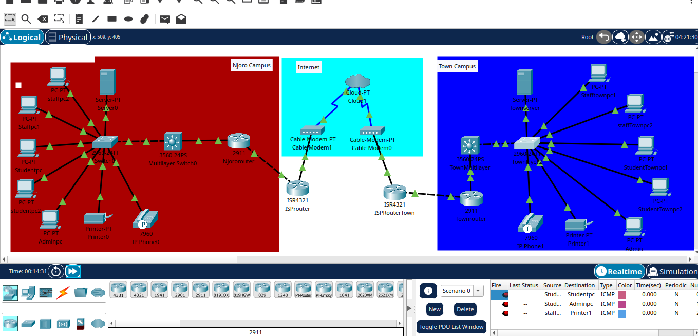

This project demonstrates connecting two campuses (Nakuru and Njoro) using VLANs, ISP/cloud connectivity, and network segmentation to separate students from staff and teachers.

## Project Features
- **VLAN Implementation:** Separate networks for Students, Teachers, and Staff.
- **Inter-campus Connectivity:** Secure communication via ISP and cloud (VPN or routed link).
- **Access Control:** Students cannot access Staff/Teacher VLANs.
- **Scalability:** Easy to add more campuses or cloud resources.
- **Packet Tracer File:** `vlansetup.pkt`

## Network Diagram

## How to Open
1. Download `vlansetup.pkt`.
2. Open using **Cisco Packet Tracer**.
3. Explore VLAN configurations, ACLs, and inter-campus routing.

## Author
**Erick Mutua**
